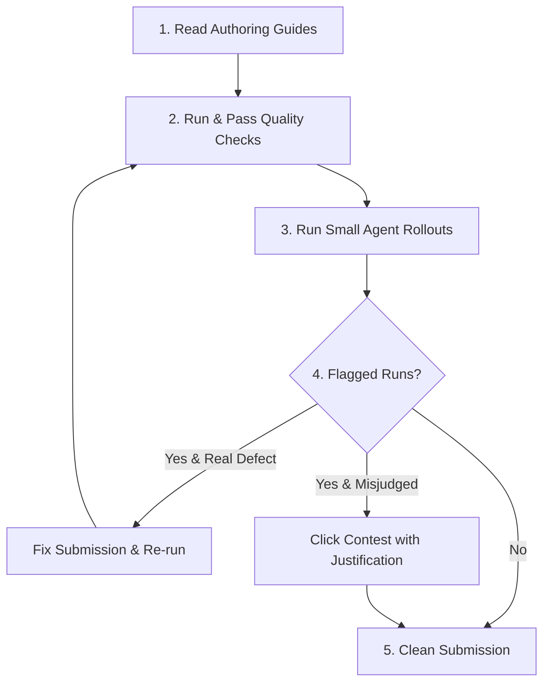
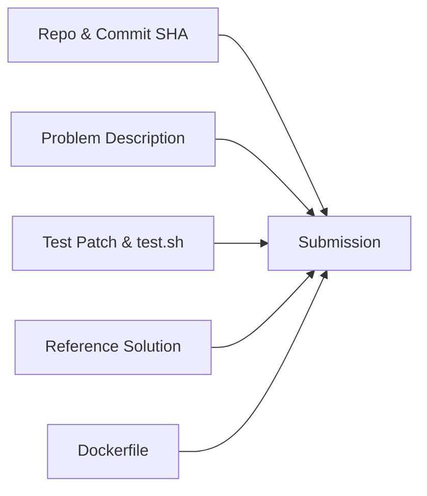

# ShipdAI & Quest Olympus Submission Guide

A comprehensive, organized reference for creating, verifying, and submitting benchmark challenges on **ShipdAI** and **Quest Olympus**.

---

## Table of Contents

1. [Executive Overview & Creator Workflow](#1-executive-overview--creator-workflow)
2. [ShipdAI Challenge Submission Form](#2-shipdai-challenge-submission-form)
   - [Form Fields & Requirements](#form-fields--requirements)
   - [Problem Description Examples (Bad vs. Good)](#problem-description-examples-bad-vs-good)
3. [Submission Pipeline & Automated Quality Checks](#3-submission-pipeline--automated-quality-checks)
   - [Stage 1: Scope Gate (Prechecks)](#stage-1-scope-gate-prechecks)
   - [Stage 2: Build Image](#stage-2-build-image)
   - [Stage 3: Quality Checks](#stage-3-quality-checks)
   - [Detailed Check Audit Logs](#detailed-check-audit-logs)
4. [Quest Olympus Authoring Guidelines](#4-quest-olympus-authoring-guidelines)
   - [01. Welcome to Quest Olympus](#01-welcome-to-quest-olympus)
   - [02. How a Submission Works](#02-how-a-submission-works)
   - [03. Selecting a Repository](#03-selecting-a-repository)
   - [04. Drafting the Problem Description](#04-drafting-the-problem-description)
   - [05. Test Suite & `test.sh` Harness](#05-test-suite--testsh-harness)
   - [06. Solution Implementation](#06-solution-implementation)
   - [07. Dockerfile Specifications](#07-dockerfile-specifications)
   - [08. Solvability & Agent Verification](#08-solvability--agent-verification)
   - [09. Local Review Protocol](#09-local-review-protocol)
   - [10. Token Economy & Check Staleness](#10-token-economy--check-staleness)
   - [11. Submission & Auto Review Requirements](#11-submission--auto-review-requirements)
5. [Complete Approved Submission Example (FrostDB)](#5-complete-approved-submission-example-frostdb)
6. [Creator Best Practices & Token Optimization](#6-creator-best-practices--token-optimization)

---

## 1. Executive Overview & Creator Workflow

Follow this core 5-step workflow when building a challenge on ShipdAI / Quest Olympus:



### Core Workflow Rules

1. **Read the guides first**: Understand what makes a strong submission and how each automated check works.
2. **Pass quality checks before rollouts**: Run prechecks and quality checks first. A flagged check indicates a defect in your submission—fix it and rerun before proceeding. Do not spend tokens on agent rollouts while checks are failing or stale.
3. **Run rollouts incrementally**: Start with 1–2 agents to observe how they behave on your task. If they surface an ambiguity or issue, fix it immediately rather than burning tokens across a full batch.
4. **Address every flagged run**: If a run returns a test mismatch, ambiguous-task flag, or environment error showing a **Contest** button:
   - **Claim is valid**: Fix your submission and rerun.
   - **Claim is invalid** (evaluator misjudged task or infra failure): Click **Contest** and provide a clear rationale. Contested runs do not count against your criteria.
   - *Note*: Pure platform/API failures are automatically refunded and never count against you.
5. **Only submit clean**: Submitting with stale or failing quality checks, or unaddressed flagged runs, results in an automatic rejection.

---

## 2. ShipdAI Challenge Submission Form

### Form Fields & Requirements

| Form Section | Field | Format / Requirements |
| :--- | :--- | :--- |
| **Repository** | **GitHub Repository URL** | Public GitHub URL meeting repository criteria (e.g., `https://github.com/feast-dev/feast`) |
| | **Commit Hash** | 40-character SHA ref. Short hex prefixes auto-expand to the full 40-char SHA on blur. |
| **Challenge Details** | **Title** | Concise, descriptive name for the task |
| | **Task Prompt** | 100–200 words natural prose description (see guidelines below) |
| | **Category** | Select one: `Feature`, `Bugfix`, `Optimization`, `Enhancement`, `Refactor` |
| | **Language** | Select primary language: `Python`, `Rust`, `TypeScript`, `JavaScript`, `Java`, `Go`, `C++` |
| **Environment** | **Dockerfile** | Base image from public ECR, sets `WORKDIR /app`, installs dependencies offline. |
| | **Test Patch** | Unified diff format (contains `+++`, `---`, `@@`, or `diff --git`) including `test.sh`. |

---

### Problem Description Examples (Bad vs. Good)

> [!WARNING]
> **Avoid Spec-Sheet Formatting**
> Do not use headings, bulleted requirement lists, or code snippets to describe tasks. Describe expected observable behavior in maintainer-style natural prose.

#### ✗ BAD Example (Over-structured, Spec-Sheet Style)

```markdown
# Task: Implement Minimal Kusto Query Language (KQL) Dialect

Implement a new `kql` dialect in `querylib/dialects/kql.py` that parses KQL queries into standard SQL ASTs. All generated outputs must be equivalent standard SQL strings.

## Behavioral Requirements

### 1. Piped Syntax & Pipe Handling
KQL uses the sequential pipe operator (`|`) to chain commands. You must ensure the parser does not treat `|` as a bitwise OR operator inside expressions (e.g., in a `where` clause), as this will cause parse errors for subsequent piped commands.

### 2. Supported Commands & Mappings
The parser must support these piped commands and their standard SQL equivalents:
- `where`: Supporting `==` for equality.
- `project`: Supporting `=` assignment (`NewCol = OldCol`).
- `take` / `limit`: Row limiting.
- `sort by` / `order by`: Handle the compound `BY` token.
- `count`: Shorthand for `summarize count()` (should generate `SELECT COUNT(*) FROM ...`).

### 3. Let Statements (Substitution)
Support one or more leading `let` statements defining simple scalar values (e.g., `let x = 1;`). Variable references in the subsequent query must be substituted with their declared expressions.

### 4. Special Functions & Standalone Tables
- **Functions**: Parse `bin(col, interval)` and `ago(interval)`. Emit them as uppercase pass-through calls (`BIN`, `AGO`) in the final SQL.
- **Standalone Tables**: A standalone table identifier (e.g., `Events`) must be parsed as a full query (`SELECT * FROM Events`).
```

#### ✓ GOOD Example (Natural Prose, Maintainer-Issue Style)

```markdown
Add a `kql` dialect that parses Kusto Query Language queries into standard SQL. KQL chains commands with pipes, and each command maps onto plain SQL: `where` filters rows and accepts `==` for equality, `project` picks and renames columns (`NewCol = OldCol`), `take` and `limit` cap the row count, `sort by` and `order by` order results, and a bare `count` comes out as `SELECT COUNT(*)`. A standalone table name like `Events` is a complete query of its own, equivalent to `SELECT * FROM Events`.

A query can open with `let` statements binding simple scalars (`let x = 1;`); later references are substituted with the declared expression. `bin(col, interval)` and `ago(interval)` pass through as uppercase `BIN` and `AGO` calls. Whatever the input, the output must be an equivalent standard SQL string.

Note that `|` only ever separates commands — inside a `where` expression it's never an operator.
```

---

## 3. Submission Pipeline & Automated Quality Checks

The platform processes submissions through a strict, multi-stage pipeline. You must pass each gate before proceeding to the next.

### Stage 1: Scope Gate (Prechecks)
Verifies your task is original, well-formed, and fits the repo before the rest of the funnel opens.

| Category | Checks Included |
| :--- | :--- |
| **GitHub Repository** | Validates URL/commit resolve, 500+ stars, supported language, recent commit (<1 year), permissive license. |
| **Problem Description & Tests** | • Length (100-200 words) <br> • Not AI-generated (line wrapping, em-dashes) <br> • Matches selected category <br> • Valid UTF-8 <br> • Not plagiarized (embedding search) <br> • Test patch sanity checks <br> • Test patch applies correctly <br> • Description sanity (No URLs) <br> • Quality & Alignment (AI) <br> • Contains only necessary info (AI) <br> • Problem & tests agree (AI) <br> • Test file names don't collide with defaults (AI) |
| **Plagiarism Review** | LLM compares against flagged similar problems (only runs if prior step finds candidates). |
| **Dockerfile** | • Dockerfile guidelines (base image, WORKDIR, safe installs, etc.) <br> • Python installs are editable or test invocation is documented (Python-only). |
| **Solution Patch** | Validates the solution patch as a unified diff. |

### Stage 2: Build Image
Builds the environment for your specific version. Subsequent quality checks run against this per-version image.

### Stage 3: Quality Checks
Runs extensive verification against your tests, solution, and descriptions.

| Check Name | Description |
| :--- | :--- |
| **Verify Tests** | Runs the test patch against the clean repo and reports how many tests pass *before* any solution is applied. |
| **Verify Solution** | Applies the solution patch on top of the test patch and reports the full per-test pass/fail breakdown. |
| **Test Fairness** | AI agent reads the repo at the pinned commit and judges whether each hidden test is fair (prompt-stated, repo-discoverable, or unsupported). |
| **Environment Quality** | (Optional) Validator agent tries to build and run the project's unit tests offline. Fails if canonical commands can't be found/working within ~25 turns. |
| **Verify Flakiness** | Runs tests 6× on clean repo and 6× with test patch to catch flaky tests. |
| **Task Quality** | AI grades the problem statement and tests against a 7-criterion rubric. |
| **Solution Quality** | AI scores the reference solution for comprehensiveness and code quality against a 2-criterion rubric. |
| **Description Quality** | AI reviews the description for tone, redundancy, and inferrable information, and flags rewrites. |

---

### Detailed Check Audit Logs

Expand any section below to view the raw diagnostic JSON returned by the platform evaluators:

<details>
<summary><strong>1. Repository Compliance Check</strong></summary>

```json
{
  "checks": {
    "activeMaintenance": "pass",
    "language": "pass",
    "license": "pass",
    "stars": "pass",
    "validCommit": "pass"
  },
  "commitHash": "f843c632976b018ca9f81c925385e7be5fdbb41d",
  "owner": "feast-dev",
  "repo": "feast",
  "repoInfo": {
    "language": "python",
    "license": "apache-2.0",
    "stars": 7160
  }
}
```
</details>

<details>
<summary><strong>2. Description Word Count Check</strong></summary>

```json
{
  "errorThreshold": 1000,
  "target": 500,
  "warningThreshold": 500,
  "wordCount": 131
}
```
</details>

<details>
<summary><strong>3. AI-Generated Pattern Check</strong></summary>

```json
{
  "emdashes": 0,
  "hardwrappedParagraphs": 0,
  "wallOfText": 0,
  "wordCount": 130
}
```
</details>

<details>
<summary><strong>4. Problem Description Category Alignment</strong></summary>

```json
{
  "feedback": "The problem description outlines a new feature that introduces state transitions for `FeatureViewState`, allowing the management of feature views through various states like `CREATED`, `GENERATED`, etc. This implementation enhances the functionality by adding specific behavior around the state transitions, handling errors, and validating states. This aligns directly with the definition of `feature_request`, as it describes building a completely new capability that did not previously exist. As such, the description does match the assigned category.",
  "status": "pass",
  "suggested_category": "none"
}
```
</details>

<details>
<summary><strong>5. UTF-8 & ASCII Validation</strong></summary>

```json
{
  "field": "description"
}
```
</details>

<details>
<summary><strong>6. Plagiarism & Similarity Check</strong></summary>

```json
{
  "matchCount": 40,
  "threshold": 0.9,
  "topScore": 0.49722588062286377
}
```
</details>

<details>
<summary><strong>7. Test Patch Sanity Checks</strong></summary>

```json
{
  "all_issues": "",
  "base_new_mode_support": {
    "explanation": "test.sh supports distinct modes:\n- new: runs newly added tests at sdk/python/tests/unit/test_feature_view_state_lifecycle_a8f3b2.py\n- base: runs existing baseline tests at sdk/python/tests/unit/test_feature_view_state.py\nThe selections are distinct and exclude the new tests in base mode.",
    "status": "OK"
  },
  "executable_permissions": {
    "explanation": "test.sh is added with mode 100755 (executable).",
    "status": "OK"
  },
  "junit_xml_output": {
    "explanation": "pytest is invoked with --junitxml=\"$OUTPUT_PATH\" in both base and new modes, producing JUnit XML at the specified path.",
    "status": "OK"
  },
  "no_environment_dockerfile": {
    "explanation": "No Dockerfile or environment-related files are included in the patch.",
    "status": "OK"
  },
  "no_irrelevant_changes": {
    "explanation": "No unrelated edits or reformatting detected. Only additions necessary for tests.",
    "status": "OK"
  },
  "no_malicious_code": {
    "explanation": "No obfuscated commands, external network calls, or suspicious behavior.",
    "status": "OK"
  },
  "no_package_installation": {
    "explanation": "test.sh only invokes pytest and does not install packages.",
    "status": "OK"
  },
  "no_solution_code": {
    "explanation": "Patch adds only a test runner (test.sh) and a new pytest file. No implementation files modified.",
    "status": "OK"
  },
  "output_path_flag": {
    "explanation": "test.sh accepts --output_path both as --output_path=<path> and --output_path <path>.",
    "status": "OK"
  },
  "relevant_files_only": {
    "explanation": "All changes are test-related.",
    "status": "OK"
  },
  "test_runner_present": {
    "explanation": "A test runner script test.sh is added at the repository root.",
    "status": "OK"
  },
  "valid_git_diff": {
    "explanation": "Patch is a valid unified git diff with two added files.",
    "status": "OK"
  }
}
```
</details>

<details>
<summary><strong>8. Test Patch Apply Check</strong></summary>

```json
{
  "patchField": "testPatch"
}
```
</details>

<details>
<summary><strong>9. Problem Description AI Sanity Check</strong></summary>

```json
{
  "all_issues": "",
  "no_urls_in_description": {
    "explanation": "No URLs or web links were found in the problem description.",
    "status": "OK"
  }
}
```
</details>

<details>
<summary><strong>10. Problem & Test Quality Check (AI)</strong></summary>

```json
{
  "all_issues": "Summary: Problem description and tests are aligned and professionally sound.",
  "no_test_leakage": {
    "explanation": "The problem brief does not mention or rely on any new test files or patch-specific logic.",
    "status": "OK"
  },
  "sanity_check": {
    "explanation": "Problem and tests are coherent and professional.",
    "status": "OK"
  },
  "tests_cover_required_behavior": {
    "explanation": "Tests cover all major requirements stated in the prompt.",
    "status": "OK"
  },
  "tests_focus_on_behavior": {
    "explanation": "Assertions validate public behavior through public methods and attributes.",
    "status": "OK"
  }
}
```
</details>

<details>
<summary><strong>11. Problem & Test Alignment Check (AI)</strong></summary>

```json
{
  "all_issues": "",
  "problem_description_provides_sufficient_public_interface_information": {
    "explanation": "The problem description specifies all new/essential public interfaces required by tests.",
    "status": "OK"
  },
  "tests_and_problem_agree_on_specific_behaviors": {
    "explanation": "All behavioral expectations in tests are covered without contradiction.",
    "status": "OK"
  }
}
```
</details>

<details>
<summary><strong>12. Test Filename Collision Check (AI)</strong></summary>

```json
{
  "newFiles": [
    "sdk/python/tests/unit/test_feature_view_state_lifecycle_a8f3b2.py"
  ],
  "predictedPaths": [
    "sdk/python/tests/unit/test_feature_view_state.py",
    "sdk/python/tests/unit/feature_view_state_test.py",
    "sdk/python/tests/unit/test_feature_view_state_transitions.py"
  ]
}
```
</details>

<details>
<summary><strong>13. LLM Plagiarism Comparison</strong></summary>

```json
{
  "skipped": false
}
```
</details>

<details>
<summary><strong>14. Dockerfile Guidelines Check</strong></summary>

```json
{
  "all_issues": "",
  "base_image_compliant": {
    "explanation": "FROM public.ecr.aws/d3j8x8q7/olympus-base-python:latest is compliant.",
    "status": "OK"
  },
  "dependencies_installed": {
    "explanation": "Dependencies installed during build phase.",
    "status": "OK"
  },
  "interactive_shell": {
    "explanation": "Ends with CMD [\"/bin/bash\"].",
    "status": "OK"
  },
  "no_test_execution": {
    "explanation": "No tests executed during build.",
    "status": "OK"
  },
  "package_manager_installation": {
    "explanation": "Does not re-install existing base package managers.",
    "status": "OK"
  },
  "registry_compliant": {
    "explanation": "Base image is hosted on public.ecr.aws.",
    "status": "OK"
  },
  "repository_setup": {
    "explanation": "WORKDIR /app and COPY . . are present.",
    "status": "OK"
  },
  "security_safety": {
    "explanation": "No obfuscated commands, external scripts, or hard-coded secrets.",
    "status": "OK"
  },
  "user_creation_compatible": {
    "explanation": "No incompatible user creation performed.",
    "status": "OK"
  },
  "version_pinning": {
    "explanation": "All pip installs specify explicit versions (==).",
    "status": "OK"
  }
}
```
</details>

<details>
<summary><strong>15. Description Optimization Suggestions (AI Warning)</strong></summary>

```json
{
  "status_reasoning": "There are 2 medium-priority suggestions for problem description refinement.",
  "suggestions": [
    {
      "priority": "medium",
      "quote": "`state` is a persisted attribute of a feature view.",
      "suggestion": "Remove this line. Persistence is implied by the need to filter by state in list APIs and observe state changes across operations."
    },
    {
      "priority": "medium",
      "quote": "`FeatureStore.list_feature_views(state=...)` and `Registry.list_feature_views(project=..., state=...)` both accept an optional `state: FeatureViewState` filter.",
      "suggestion": "Remove explicit method names and parameter signatures. State high-level listing filter requirements instead; exact method signatures are discoverable in codebase."
    }
  ],
  "summary": "- [MEDIUM] Remove redundant attribute statements.\n- [MEDIUM] Omit explicit method signatures in favor of behavioral requirements.",
  "verdict": "minor_suggestions"
}
```
</details>

---

## 4. Quest Olympus Authoring Guidelines

### 01. Welcome to Quest Olympus

Submissions in Quest Olympus consist of:
1. Creating a task similar to a complex real-world GitHub issue.
2. Writing rigorous tests that define success.
3. Writing a reference solution that proves the task is solvable.

> [!IMPORTANT]
> Tasks must be genuinely challenging to test state-of-the-art AI models. If a task seems straightforward, increase its depth and complexity.

---

### 02. How a Submission Works

A complete submission requires five distinct assets:



---

### 03. Selecting a Repository

Your repository serves as the foundation. Ensure it meets all baseline requirements. A thin or flat repo caps your difficulty ceiling no matter how good your idea is, so pick a serious, active project.

#### Mandatory Requirements
- **Public GitHub Repository** with active maintenance (at least 1 commit in last 12 months).
- **500+ Stars** on GitHub.
- **Production-level codebase** in one of the allowed languages: `TypeScript`, `JavaScript`, `Python`, `Go`, `Rust`, `C++`, `Java`.
- **Permissive Open-Source License** (Apache 2.0, MIT, BSD, etc.).

#### Critical Exclusion Rules

> [!CAUTION]
> **Rejection Pitfalls**
> - **R1 (Inactive Repo)**: Do not use abandoned or archived repositories.
> - **R2 (Existing PRs)**: Ensure **no open, merged, or closed PR** already implements or addresses your task idea. An unmerged or closed PR that attempted your task invalidates it.
> - **R3 (Declined Features)**: Verify maintainers have not explicitly rejected the feature in GitHub Issues or Discussions. A declined feature counts as misalignment with the repo.
> - **R4 (Scope Alignment)**: Ensure the task naturally fits the project's design philosophy.

---

### 04. Drafting the Problem Description

Write the problem description the way a maintainer writes an issue—natural prose, full sentences. Open with the ask itself and skip the "what the repo currently lacks" preamble.

#### Core Principles
- **P1**: Aligns with repo philosophy.
- **P2**: Unsolved by any past PR (open, merged, closed).
- **P3**: Self-contained (solvable from codebase + prompt alone).
- **P4**: Clear, concise, and unambiguous.
- **P5**: Objectively testable via automated assertions.
- **P6**: Non-prescriptive (does not leak solution details or file paths).
- **P7**: Unique (passes plagiarism similarity check vs existing submissions).

> [!WARNING]
> **Avoid Spec-Sheet Formatting**
> Keep it out of spec-sheet territory. Do not use bulleted requirement lists, headings, or code snippets doing the describing. Do not spell out what a developer would find on their own (internal class names, helpers, file layout); describe the behavior, not the implementation. However, if a detail is genuinely part of the contract and the task can't be pinned down without it, state it.

---

### 05. Test Suite & `test.sh` Harness

Your test suite defines success. It runs inside an offline container (`--network none`).

#### Test Rules (T1–T8)
- **T1**: Highlights missing/buggy behavior (100% fails at base commit, 100% passes with solution).
- **T2**: Deterministic (no flaky timers, random seeds, or order dependence).
- **T3**: Strict assertions (prevents naive or incomplete solutions from passing).
- **T4**: Comprehensive edge case coverage.
- **T5**: No unspecified behavior assertions.
- **T6**: Strictly offline compatible (`--network none`).
- **T7**: No rigid over-pinning of log output strings unless explicitly mandated.
- **T8**: Keep failure diagnostics intact. When a test fails, the results should show which test failed and its real assertion output. Do not hide real failures behind catch-all messages or mask upstream errors.

#### The `test.sh` Harness Contract

Create a `test.sh` runner at the repository root accepting `--output_path <path>`:

- `./test.sh --output_path results.xml base`: Runs existing repository regression tests in the change's blast radius. **Must pass both before and after solution.** Do not use fail-fast flags.
- `./test.sh --output_path results.xml new`: Runs your new task tests. **Must fail before solution, pass after solution.**

If some existing tests are flaky, require network, or fail for existing issues, exclude them, but do NOT exclude valid tests because your solution breaks them.

#### Generating the Test Patch

```bash
# Make your test additions, then generate the patch:
git diff > test.patch

# Verify clean application:
git stash
git apply test.patch
git stash pop
```

> [!WARNING]
> **No Challenge Leaks**
> Do not use names like `challenge`, `quest`, `olympus`, or `mars` in file names, comments, or test patches. The patch must look like a standard, professional PR.

---

### 06. Solution Implementation

The reference solution proves solvability:

- **S1**: Fully satisfies all requirements.
- **S2**: Zero regressions (passes `base` regression test suite).
- **S3**: No unrelated formatting or refactoring edits.
- **S4**: Clean, idiomatic code without AI-generated artifacts.

---

### 07. Dockerfile Specifications

Container builds must set up the environment completely offline:

1. **Base Image Selection**:
   - Python: `public.ecr.aws/d3j8x8q7/olympus-base-python:latest`
   - TypeScript / JS: `public.ecr.aws/d3j8x8q7/olympus-base-typescript:latest`
   - Go: `public.ecr.aws/d3j8x8q7/olympus-base-go:latest`
   - Rust: `public.ecr.aws/d3j8x8q7/olympus-base-rust:latest`
   - Java / JVM: `public.ecr.aws/d3j8x8q7/olympus-base-jvm:latest`
   - C++: `public.ecr.aws/d3j8x8q7/olympus-base-cpp:latest`
2. **`WORKDIR /app`**: Standard root directory.
3. **Pre-install dependencies** during build (`RUN pip install ...` or `RUN go mod download`).
4. **No tests in Dockerfile**: Do not execute tests during container image build.
5. **Entrypoint**: Must end with `CMD ["/bin/bash"]`.

#### Skeleton Dockerfile Template

```dockerfile
FROM public.ecr.aws/d3j8x8q7/olympus-base-<language>:latest

WORKDIR /app

COPY . .

# Install dependencies offline during image build phase
# RUN pip install -r requirements.txt

CMD ["/bin/bash"]
```

---

### 08. Agent Rollouts & Solvability

A rollout is one agent taking a real shot at your challenge. It gets your problem description, your repo at the pinned commit, and your Docker environment, writes a solution, and gets graded against your tests.

#### Quick Checks vs Full Batches
- **Quick Check**: A single, cheap run. Use it while iterating to see if agents understand the task and if your environment holds up.
- **Full Batch**: Fires several runs in one go. Use this once confident to rack up finished runs and meet the submission bar.

*Note: A rollout typically takes ~15 minutes but can take up to 90 minutes for complex repos. Wait for runs to finish; they only count towards your quota once completed.*

#### Verification
- **Check Agent Behavior**: Read the fails! An agent failing because the task is hard is exactly what you want. If they fail due to ambiguous phrasing or unfair tests, fix it.
- **LOC Bar Verification**: Only effective solution logic lines count toward your lines-of-code (LOC) threshold. Comments, blanks, and test code are excluded.

---

### 09. Local Review Protocol

Run this 9-step local review sequence before submitting:

```bash
# 1. Checkout exact commit SHA
git checkout <commit-hash>

# 2. Apply test patch
git apply test.patch

# 3. Build Docker container
docker build -t challenge-test .

# 4-5. Run container offline & verify test behavior
docker run --rm --network none challenge-test ./test.sh --output_path /tmp/base.xml base # MUST PASS
docker run --rm --network none challenge-test ./test.sh --output_path /tmp/new.xml new   # MUST FAIL

# 6-7. Apply solution patch & re-verify
git apply solution.patch
docker build -t challenge-test .
docker run --rm --network none challenge-test ./test.sh --output_path /tmp/base.xml base # MUST PASS
docker run --rm --network none challenge-test ./test.sh --output_path /tmp/new.xml new   # MUST PASS

# 8. Confirm no existing PR already solves the issue.
# 9. Confirm your submission passes every point in this guide.
```

---

### 10. Token Economy & Check Staleness

- **Token Consumption**: Running pre-checks and agent rollouts consumes tokens. Work through checks one at a time and clear them before running expensive agent rollouts.
- **Check Staleness**: Any edit made to problem description, patches, or Dockerfile invalidates completed check results. Stale checks must be rerun before submission, consuming additional tokens. Read rollout results *before* editing to avoid making in-flight runs stale.
- **Be Your Own Reviewer**: Fix all issues thoroughly in one pass before rerunning to save tokens.
- **Tiered Replenishment**: Tokens replenish hourly based on your contributor approval tier.

---

### 11. Submission & Auto Review Requirements

To submit your challenge and potentially qualify for Auto Review, your rollout results must meet the following criteria:

#### General Requirements
- **Fair task**: No agent run flagged the task as unfair or broken.
- **Solvable**: At least 1 agent run must solve the problem.
- **No cheating**: Cheat rate must be below 20% (across all agents).
- **No environment blockers**: No run should be blocked by environment or verifier issues.

#### Difficulty & Depth
- **Minimum runs**: At least 10 agent runs must complete.
- **Difficulty**: Pass rate must be ≤ 50%.
- **Long-horizon**: Median of successful agent runs must be: ≥ 2 files changed, ≥ 20 messages exchanged, and ≥ 200 LOC.

#### LOC Rules
- **Effective LOC**: Counts only functional code lines inside reference solution files.
- **Excluded**: Blank lines, imports, documentation, test scripts, and generated code.

---

## 5. Complete Approved Submission Example (FrostDB)

Below is a complete, approved Olympus submission reference:

### Challenge Details
- **Language**: Go
- **Repository**: `https://github.com/polarsignals/frostdb`
- **Commit SHA**: `9e5cfe0171adff531d30a9df3e111686996f4a9f`

### Problem Description
> frostdb answers grouped aggregation queries by splitting a table into independent partitions, aggregating each partition on its own, and then combining those partial results into one row per group. The aggregations below must return the same answer no matter how the rows of a group are spread across partitions or how many partitions there are.
>
> Add support for distinct aggregations. `count(distinct x)` counts how many different non-null values a group holds, `sum(distinct x)` adds each different value once, and `avg(distinct x)` averages the different values. A value that appears in several rows, or in several partitions, counts only once. `count(distinct x)` accepts numeric or string columns; `sum(distinct x)` and `avg(distinct x)` accept numeric columns. Today a distinct qualifier is ignored, so these behave like their plain counterparts, which is wrong whenever a value repeats.
>
> Every one of these aggregations ignores null inputs. When a group has no contributing values the distinct count is zero and the other aggregations are null. All of them are reached through ordinary grouped SQL queries and must coexist with the existing aggregations, which keep working unchanged.

### Dockerfile
```dockerfile
FROM public.ecr.aws/d3j8x8q7/olympus-base-go:latest

WORKDIR /app
COPY . .

RUN go mod download
RUN GOBIN=/usr/local/bin go install github.com/jstemmer/go-junit-report/v2@v2.1.0

ENV GOFLAGS="-mod=readonly"
ENV CGO_ENABLED=0

RUN go build ./...

CMD ["/bin/bash"]
```

### Test Harness (`test.sh`)
```bash
#!/usr/bin/env bash
# Test runner for the holistic aggregations challenge.
# Usage: ./test.sh [--output_path <junit.xml>] <base|new>

set -uo pipefail
cd /app

OUTPUT_PATH=""
if [ "${1:-}" = "--output_path" ]; then
  OUTPUT_PATH="$2"
  shift 2
fi

MODE="${1:-new}"
export GOMAXPROCS=4

TEST_LOG="$(mktemp)"
STATUS=0

run_tests() {
  regex="$1"
  shift
  if [ -n "$regex" ]; then
    go test -count=1 -v -run "$regex" "$@" 2>&1 | tee -a "$TEST_LOG"
  else
    go test -count=1 -v "$@" 2>&1 | tee -a "$TEST_LOG"
  fi
  status=${PIPESTATUS[0]}
  if [ "$status" -ne 0 ]; then
    STATUS=$status
  fi
}

case "$MODE" in
  base)
    run_tests "" ./query/ ./query/expr/... ./query/exprpb/... ./query/logicalplan/... ./sqlparse/...
    run_tests '^(TestAndExprShortCircuits|TestBinaryScalarOperationNotImplemented|TestBuildIndexRanges|TestBuildPhysicalPlan|TestOrderedAggregate|TestOrderedAggregateDynCols|TestOrderedSynchronizer|TestSynchronize|Test_ArrayScalarCompute_Leak|Test_BuildIndexRanges|Test_Sampler|Test_Sampler_Materialize|Test_MaxSizeAllocation)$' ./query/physicalplan/...
    ;;
  new)
    run_tests '^TestHA*' ./challenge/...
    ;;
  *)
    echo "unknown mode: $MODE (expected base or new)" >&2
    exit 2
    ;;
esac

if [ -n "$OUTPUT_PATH" ]; then
  go-junit-report -set-exit-code < "$TEST_LOG" > "$OUTPUT_PATH" || true
fi

exit "$STATUS"
```

### Test Patch (`test.patch`) Snippet
```diff
diff --git a/challenge/holistic_aggregation_test.go b/challenge/holistic_aggregation_test.go
new file mode 100644
--- /dev/null
+++ b/challenge/holistic_aggregation_test.go
@@ -0,0 +1,632 @@
+package challenge
+
+func TestHA_CountDistinctSingleRecord(t *testing.T) {
+    s := intSchema(t)
+    recs := []arrow.Record{recInt([]string{"a", "a", "a"}, []int64{1, 1, 2}, nil)}
+    got := intByGroup(t, s, recs, "SELECT g, count(distinct value) FROM test GROUP BY g")
+    require.Equal(t, int64(2), got["a"])
+}
+
+func TestHA_CountDistinctAcrossPartitions(t *testing.T) {
+    s := intSchema(t)
+    recs := []arrow.Record{
+        recInt([]string{"a", "a", "a"}, []int64{1, 2, 2}, nil),
+        recInt([]string{"a", "a"}, []int64{2, 3}, nil),
+    }
+    got := intByGroup(t, s, recs, "SELECT g, count(distinct value) FROM test GROUP BY g")
+    require.Equal(t, int64(3), got["a"])
+}
```

### Solution Patch (`solution.patch`) Snippet
```diff
diff --git a/query/logicalplan/builder.go b/query/logicalplan/builder.go
--- a/query/logicalplan/builder.go
+++ b/query/logicalplan/builder.go
@@ -231,6 +231,34 @@ func resolveAggregation(plan *LogicalPlan, agg *AggregationFunction) ([]*Aggrega
 			Right: countExpr,
 		}).Alias(agg.String())
 
+	case AggFuncAvgDistinct:
+		sum := &AggregationFunction{
+			Func: AggFuncSumDistinct,
+			Expr: agg.Expr,
+		}
+		count := &AggregationFunction{
+			Func: AggFuncCountDistinct,
+			Expr: agg.Expr,
+		}
+
+		var (
+			countExpr Expr = count
+			aggType   arrow.DataType
+		)
+		aggType, err := agg.Expr.DataType(plan)
+		if !arrow.TypeEqual(aggType, arrow.PrimitiveTypes.Int64) {
+			countExpr = Convert(countExpr, aggType)
+		}
+
+		div := (&BinaryExpr{
+			Left:  sum,
+			Op:    OpDiv,
+			Right: countExpr,
+		}).Alias(agg.String())
+		return []*AggregationFunction{sum, count}, []Expr{div}, true, err
 	default:
 		return []*AggregationFunction{agg}, []Expr{agg}, false, nil
```

---

## 6. Creator Best Practices & Token Optimization

1. **Plan before coding**: Confirm task scope, non-duplication, and LOC viability before writing patches. It's tempting to jump into fixing an issue, but check if the scope is large enough to meet difficulty criteria before writing hundreds of lines of code.
2. **Consider cross-cutting changes**: A solution that cuts across several layers or subsystems tends to be harder for agents (and carries more effective LOC). It's one of the best levers for increasing task difficulty.
3. **Conserve rollout tokens**: Start with a small quick check batch to get a vibe. If it comes back at 100% pass, the task is too easy; if it's 0% due to vague points or unfair tests, catch that before committing to a full batch run.
4. **Analyze diagnostic logs**: Inspect full check JSON and rollout logs. Understanding why something failed is half the work. The more time you spend reading outputs, the faster every later submission goes.
5. **Batch edits to prevent staleness**: Fix all issues in one comprehensive pass before re-triggering automated checks. Expect to iterate to close loops yourself without paying for formal reviewer revision cycles.
